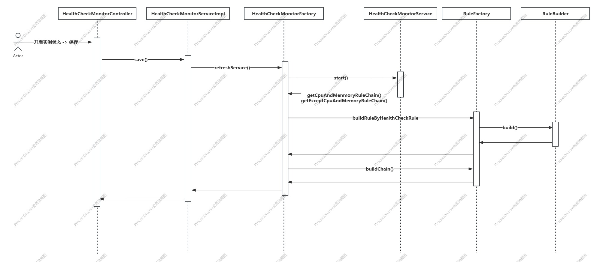
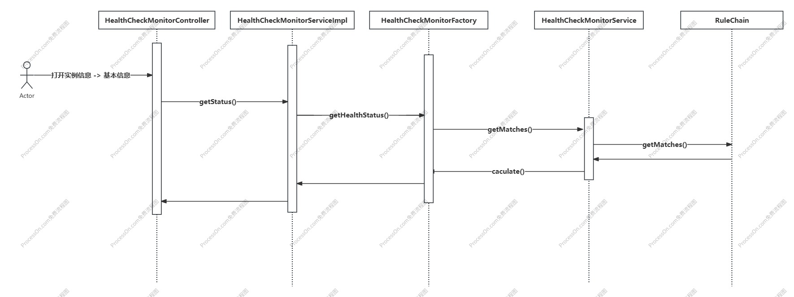

### 1、功能概述

可以实时监控实例的健康状态，从 CPU使用率、内存使用率、FullGC次数、FullGC时间、HTTP超时时间、HTTP等待任务数、HTTP错误数、JDBC 等待请求数、JDBC泄露连接数、回滚事务。多个维度评分，按照评分将实例分为 Health、Warning、Fault 三种健康度、并给出一个综合健康度。

#### 1.1 功能范围

1. 监控诊断 —— 新增实例状态配置
	
2. 实例信息 -> 基本信息  ——  新增健康状态
	
3. 点击健康状态可查看详情
	

### 2、功能详细说明

#### 2.1开启实例健康功能

在实时监控->实例状态配置 ->开启 -> 保存

#### 2.2 获取实例健康度

实例信息 -> 基本信息  初始/每隔 5s 循环调用 /console/monitor/health-check-monitor/allStatus.action
实例信息 -> 基本信息 -> 健康状态 点击健康状态展示详情

### 3、接口设计

#### 3.1 /console/monitor/health-check-monitor/saveHealthCheckMonitor.action

接口返回示例：

“ModelAndView”: {
	"healthCheckMonitorService" : {
		"enabled" : "true"
	},
	"healthCheckMonitorRules" : [
		{
			"name" : "SystemCPULoad"
			"threshold" : "90"
			"interval" : "5"
			"consecutiveTime" : "3"
		},{
			"name" : "MemoryUsed"
			"threshold" : "90"
			"interval" : "5"
			"consecutiveTime" : "3"
		}...
	]
	...
}

#### 3.2 /console/monitor/health-check-monitor/allStatus.action

接口返回示例：

“ModelAndView”: {
	"healthCheckStatus" : {
		"SystemCpuLoad" : {
			"name" : "SystemCpuLoad"
			"status" : "health"
			"currentValue" : "1.61,0.61,0.89"
			"threshold" : "90.0"
		},
		"jdbc.numWaiters" : {
			"name" : "jdbc.numWaiters"
			"status" : "warning"
			"currentValue" : "3,2,3"
			"threshold" : "1"
		}
		...
	}	
	"status" : "health"
	"score" : "95"
	...
}

### 4、数据模型设计

### 5、异常处理

