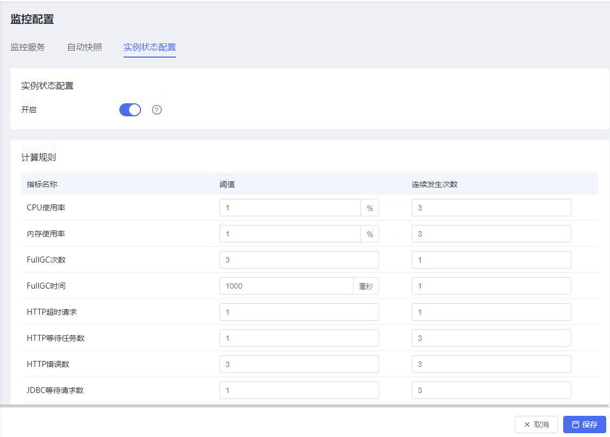
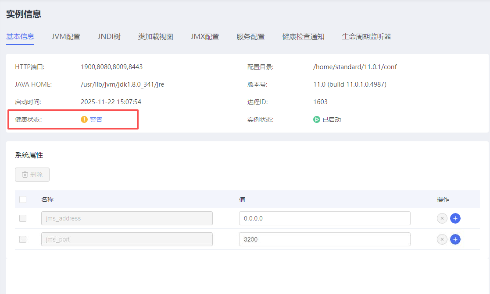
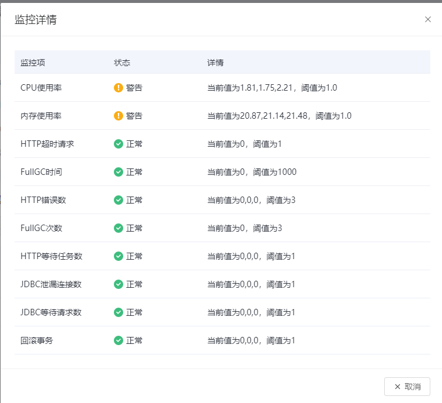

### 1、功能概述

可以实时监控实例的健康状态，从 CPU使用率、内存使用率、FullGC次数、FullGC时间、HTTP超时时间、HTTP等待任务数、HTTP错误数、JDBC 等待请求数、JDBC泄露连接数、回滚事务。多个维度评分，按照评分将实例分为 Health、Warning、Fault 三种健康度、并给出一个综合健康度。

#### 1.1 功能范围

1. 监控诊断 —— 新增实例状态配置
	
2. 实例信息 -> 基本信息  ——  新增健康状态
	
3. 点击健康状态可查看详情
	

### 2、功能详细说明

### 3、接口设计

### 4、数据模型设计

### 5、异常处理

