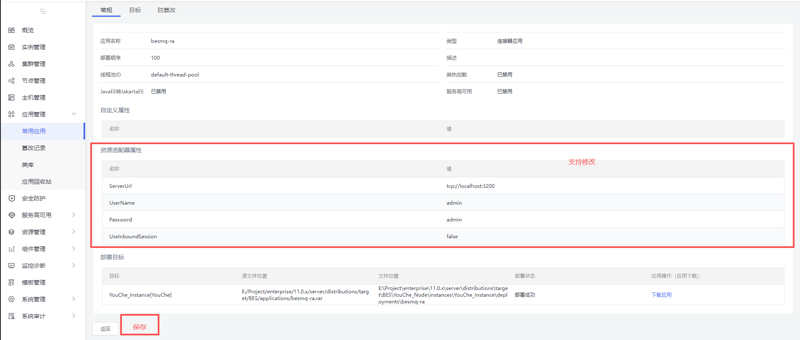

### 1、功能概述

当前的连接器应用不支持编辑资源适配器属性，想要更改属性只能重新部署，需要支持修改资源适配器属性并实时生效。

#### 1.1 功能范围

标准版：


企业版：




### 2、功能详细说明

1.  只有当前应用的类型为连接器类型（Type = connector）时才显示保存按钮
2. 当前类型不为连接器时，或者传入的连接器名称对应的连接器不存在时抛出异常
3. 保存后，会重新启动应用使配置生效，启动失败会抛出异常


### 3、接口设计

#### 3.1 /console/api/bes/config/common-app/save  POST

接口请求参数实例：

```json
{
	  "name": "besmq-ra",
	  "type": "connector",
	  "objecttype": "user",
	  "enabled": false,
	  "delegate": false,
	  "jakartaConverter": false,
	  "directoryDeployed": false,
	  "version": "",
	  "location": "E:/Project/standard/11.0.x/server/distributions/bes-webprofile/target/bes-webprofile/deployments/besmq-ra",
	  "appLocation": "E:/Project/standard/11.0.x/server/distributions/bes-webprofile/target/bes-webprofile/deployments/ internal/besmq-ra.rar",
	  "deployLocation": "E:/Project/standard/11.0.x/server/distributions/bes-webprofile/target/bes-webprofile/upload/besmq-ra.rar",
	  "precompileJsp": false,
	  "highAvailability": false,
	  "state": "application.stopped",
	  "hotDeploy": false,
	  "deployorder": 100,
	  "timeout": 600,
	  "enableWebEjb": false,
	  "enableJsf": false,
	  "enableJpa": false,
	  "enableCdi": false,
	  "enableBVal": false,
	  "enableJSONP": false,
	  "enableJaxRs": false,
	  "enableJaxWs": false,
	  "enableHotSwap": false,
	  "enableFlowControl": false,
	  "threadPool": "default-thread-pool",
	  "isRedeploy": false,
	  "properties": [],
	  "adapterResourceProperties": [
		{
		  "name": "ServerUrl",
		  "value": "tcp://localhost:3200",
		  "hasDesc": true
		},
		{
		  "name": "UserName",
		  "value": "admin",
		  "hasDesc": true
		},
		{
		  "name": "Password",
		  "value": "admin",
		  "hasDesc": true
		},
		{
		  "name": "UseInboundSession",
		  "value": "false",
		  "hasDesc": true
		}
	  ]
}
```

接口返回参数示例：

成功：
```json
{
	"success":true,
	"errno":0,
	"errmsg":"SUCCESS",
	"data":true
}
```


### 4、数据模型设计


### 5、异常处理