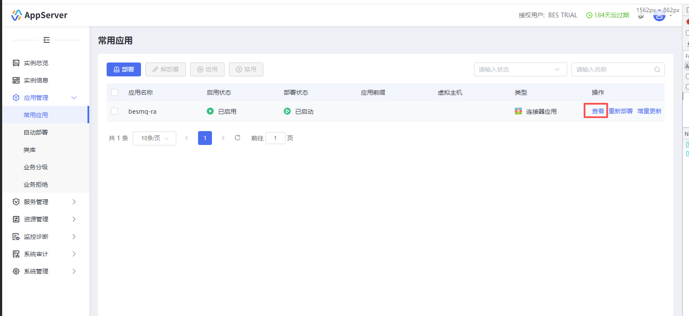
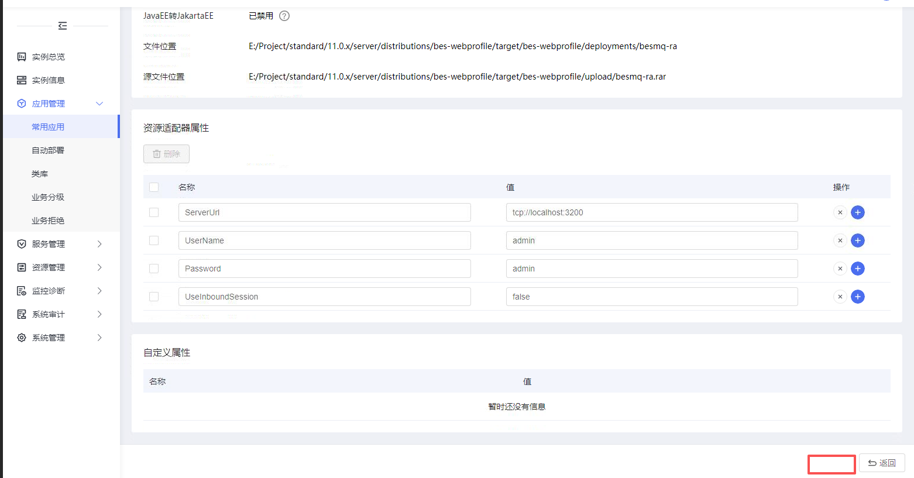

### 1、功能概述

当前的连接器应用不支持编辑资源适配器属性，想要更改属性只能重新部署，需要支持修改资源适配器属性并实时生效。

#### 1.1 功能范围

**只有当前应用的类型为连接器类型才可以保存（Type = connector）**

### 2、功能详细说明

1.  只有当前应用的类型为连接器类型（Type = connector）时才显示保存按钮

### 3、接口设计

#### 3.1 /console/api/bes/config/common-app/save  POST

接口请求参数实例：

接口返回参数示例：

“ModelAndView”: {
	"healthCheckMonitorService" : {
		"enabled" : "true"
	},
	"healthCheckMonitorRules" : [
		{
			"name" : "SystemCPULoad"
			"threshold" : "90"
			"interval" : "5"
			"consecutiveTime" : "3"
		},{
			"name" : "MemoryUsed"
			"threshold" : "90"
			"interval" : "5"
			"consecutiveTime" : "3"
		}...
	]
	...
}

### 4、数据模型设计

### 5、异常处理