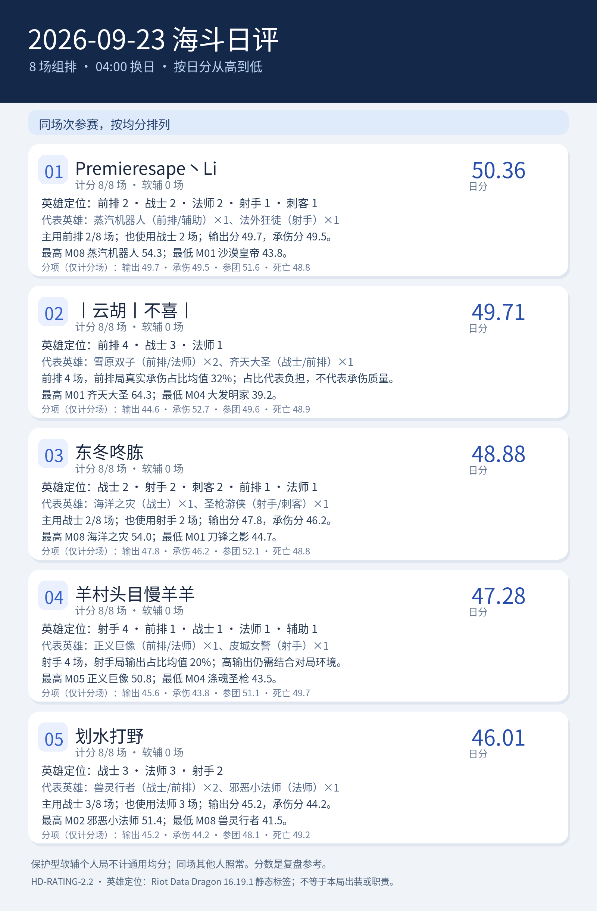

# 2026-09-23 海斗日评｜HD-RATING-2.2

<!-- HD-RATING-2.2 SUMMARY START -->

## 一图流：按分数排序

**序号说明**：按各自有效单局均分从高到低排序；每人参与同一批比赛，可作同场次比较。

**软辅处理**：经逐局核验的保护型软辅选手保留战绩，不计该局通用综合分；仍参与同场队友五人团队分母和环境调整。下面英雄分布按实际参赛局，分项点评按纳入评分局。

| 序号 | 队员 | 日分 | 计分 / 实际 | 软辅 | 主要英雄定位 |
| ---: | --- | ---: | ---: | ---: | --- |
| 1 | Premieresape丶Li#45121 | 50.36 | 8 / 8 | 0 | 前排2／战士2／法师2／射手1／刺客1 |
| 2 | 丨云胡丨不喜丨#24728 | 49.71 | 8 / 8 | 0 | 前排4／战士3／法师1 |
| 3 | 东冬咚胨#49567 | 48.88 | 8 / 8 | 0 | 战士2／射手2／刺客2／前排1／法师1 |
| 4 | 羊村头目慢羊羊#24440 | 47.28 | 8 / 8 | 0 | 射手4／前排1／战士1／法师1／辅助1 |
| 5 | 划水打野#51907 | 46.01 | 8 / 8 | 0 | 战士3／法师3／射手2 |

### 逐人点评

**1. Premieresape丶Li#45121（计分 8/8 场，软辅 0 场）**：代表英雄为蒸汽机器人（前排/辅助）×1、法外狂徒（射手）×1。主用前排 2/8 场；也使用战士 2 场；输出分 49.7，承伤分 49.5。最高 M08 蒸汽机器人 54.3；最低 M01 沙漠皇帝 43.8。

**2. 丨云胡丨不喜丨#24728（计分 8/8 场，软辅 0 场）**：代表英雄为雪原双子（前排/法师）×2、齐天大圣（战士/前排）×1。前排 4 场，前排局真实承伤占比均值 32%；占比代表负担，不代表承伤质量。最高 M01 齐天大圣 64.3；最低 M04 大发明家 39.2。

**3. 东冬咚胨#49567（计分 8/8 场，软辅 0 场）**：代表英雄为海洋之灾（战士）×1、圣枪游侠（射手/刺客）×1。主用战士 2/8 场；也使用射手 2 场；输出分 47.8，承伤分 46.2。最高 M08 海洋之灾 54.0；最低 M01 刀锋之影 44.7。

**4. 羊村头目慢羊羊#24440（计分 8/8 场，软辅 0 场）**：代表英雄为正义巨像（前排/法师）×1、皮城女警（射手）×1。射手 4 场，射手局输出占比均值 20%；高输出仍需结合对局环境。最高 M05 正义巨像 50.8；最低 M04 涤魂圣枪 43.5。

**5. 划水打野#51907（计分 8/8 场，软辅 0 场）**：代表英雄为兽灵行者（战士/前排）×2、邪恶小法师（法师）×1。主用战士 3/8 场；也使用法师 3 场；输出分 45.2，承伤分 44.2。最高 M02 邪恶小法师 51.4；最低 M08 兽灵行者 41.5。

英雄定位以 [Riot Data Dragon 16.19.1 静态标签](../../../references/riot_ddragon_16.19.1_英雄定位.json)为准；标签不说明本局出装、单前排状态或实际贡献。

<!-- HD-RATING-2.2 SUMMARY END -->

**范围**：固定名单至少三人参加的组排；本日全场对局照常保留。仅逐局确认的保护型软辅选手不计算通用综合分，其他队员同场照常计分。路人和软辅仍参与五人占比和环境系数。
**公式**：其余对局沿用 v2.1 的单局公式，输出、承伤、参团、死亡均未改权重。排除名单及证据见 [逐局清单](../../../repro/soft_support_exclusions_v2.2.json)，规则见[评分标准](../../../docs/海斗日评与月评评分标准.md)。
**样本**：8 场组排；名单队员 40 条实际参赛记录，其中 0 条软辅个人记录不进入通用均分；同一批纳入评分的比赛。
**游戏日**：北京时间 04:00 至次日 04:00；部分截图未显示精确钟点，沿用用户给出的截图日期归属。英雄参考及版本推断沿用 v2.1，仍须注意跨站真实承伤口径未经完全核实。

| 均分序位 | 队员 | 可评分对局均分 | 纳入 / 实际 | 软辅场数 | 输出分 | 承伤分 | 参团分 | 死亡分 |
| ---: | --- | ---: | ---: | ---: | ---: | ---: | ---: | ---: |
| 1 | Premieresape丶Li#45121 | 50.36 | 8 / 8 | 0 | 49.7 | 49.5 | 51.6 | 48.8 |
| 2 | 丨云胡丨不喜丨#24728 | 49.71 | 8 / 8 | 0 | 44.6 | 52.7 | 49.6 | 48.9 |
| 3 | 东冬咚胨#49567 | 48.88 | 8 / 8 | 0 | 47.8 | 46.2 | 52.1 | 48.8 |
| 4 | 羊村头目慢羊羊#24440 | 47.28 | 8 / 8 | 0 | 45.6 | 43.8 | 51.1 | 49.7 |
| 5 | 划水打野#51907 | 46.01 | 8 / 8 | 0 | 45.2 | 44.2 | 48.1 | 49.2 |

**判定与复核**：排除记录在 [v2.2 逐场明细](逐场评分明细_v2.2.csv)中以 `是否纳入通用均分=否` 标记，`单局综合分` 留空；`原公式试算分_v2.1` 仅供比较旧规则偏差，不纳入日月总分。v2.1 和 v2.0 历史 CSV 均保留原文件。
**阅读方式**：纳入率表示本版可使用的通用评分覆盖率，并非数据采集完整率；软辅局数据完整，但职责未被通用公式衡量。纳入场数不同或所玩场次不同，均分序位不能解释为同条件实力名次。

## 逐场截图

| 场次 | 队内参评者 | 原始截图 |
| --- | ---: | --- |
| M01 | 5 | [查看](../../../screenshots/2026-09-23/M01_2A8F7707AE0992A333333429A0E3DB70.png) |
| M02 | 5 | [查看](../../../screenshots/2026-09-23/M02_1A69534EB3098B0D03086B719B06F182.png) |
| M03 | 5 | [查看](../../../screenshots/2026-09-23/M03_C92B6468A84F4D2E8D7497A4204D0A94.png) |
| M04 | 5 | [查看](../../../screenshots/2026-09-23/M04_7A2D50501EAC7BE75D527D235BC76BAC.png) |
| M05 | 5 | [查看](../../../screenshots/2026-09-23/M05_79354D553D8F443F74996B7B522AC25C.png) |
| M06 | 5 | [查看](../../../screenshots/2026-09-23/M06_28D0A4BD2036BED8B5EE1BAA103C430D.png) |
| M07 | 5 | [查看](../../../screenshots/2026-09-23/M07_5D1F83BC10D16116927F305AE5990753.png) |
| M08 | 5 | [查看](../../../screenshots/2026-09-23/M08_1D9FAAEA69BAAAF8CCCFE133E6D21202.png) |
