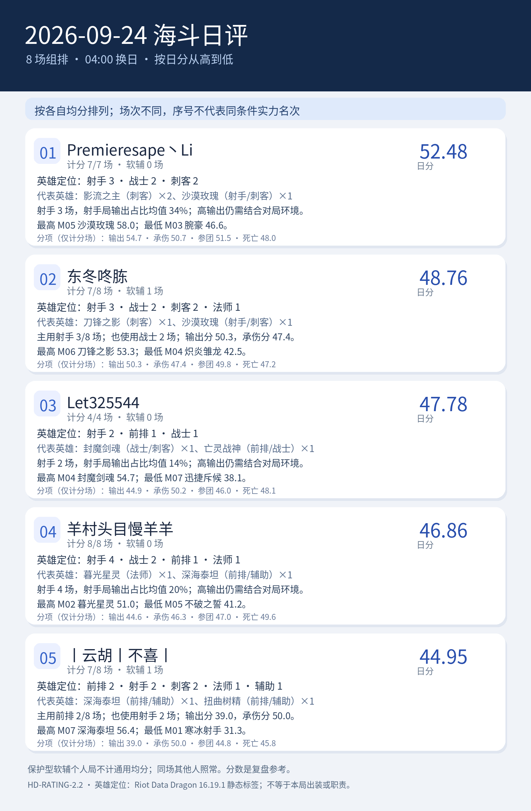

# 2026-09-24 海斗日评｜HD-RATING-2.2

<!-- HD-RATING-2.2 SUMMARY START -->

## 一图流：按分数排序

**序号说明**：按各自有效单局均分从高到低排序；参赛场次不同，序号仅代表已收集样本的均分大小，不代表同条件实力排名。

**软辅处理**：经逐局核验的保护型软辅选手保留战绩，不计该局通用综合分；仍参与同场队友五人团队分母和环境调整。下面英雄分布按实际参赛局，分项点评按纳入评分局。

| 序号 | 队员 | 日分 | 计分 / 实际 | 软辅 | 主要英雄定位 |
| ---: | --- | ---: | ---: | ---: | --- |
| 1 | Premieresape丶Li#45121 | 52.48 | 7 / 7 | 0 | 射手3／战士2／刺客2 |
| 2 | 东冬咚胨#49567 | 48.76 | 7 / 8 | 1 | 射手3／战士2／刺客2／法师1 |
| 3 | Let325544#73173 | 47.78 | 4 / 4 | 0 | 射手2／前排1／战士1 |
| 4 | 羊村头目慢羊羊#24440 | 46.86 | 8 / 8 | 0 | 射手4／战士2／前排1／法师1 |
| 5 | 丨云胡丨不喜丨#24728 | 44.95 | 7 / 8 | 1 | 前排2／射手2／刺客2／法师1／辅助1 |

### 逐人点评

**1. Premieresape丶Li#45121（计分 7/7 场，软辅 0 场）**：代表英雄为影流之主（刺客）×2、沙漠玫瑰（射手/刺客）×1。射手 3 场，射手局输出占比均值 34%；高输出仍需结合对局环境。最高 M05 沙漠玫瑰 58.0；最低 M03 腕豪 46.6。

**2. 东冬咚胨#49567（计分 7/8 场，软辅 1 场）**：代表英雄为刀锋之影（刺客）×1、沙漠玫瑰（射手/刺客）×1。主用射手 3/8 场；也使用战士 2 场；输出分 50.3，承伤分 47.4。最高 M06 刀锋之影 53.3；最低 M04 炽炎雏龙 42.5。

**3. Let325544#73173（计分 4/4 场，软辅 0 场）**：代表英雄为封魔剑魂（战士/刺客）×1、亡灵战神（前排/战士）×1。射手 2 场，射手局输出占比均值 14%；高输出仍需结合对局环境。最高 M04 封魔剑魂 54.7；最低 M07 迅捷斥候 38.1。

**4. 羊村头目慢羊羊#24440（计分 8/8 场，软辅 0 场）**：代表英雄为暮光星灵（法师）×1、深海泰坦（前排/辅助）×1。射手 4 场，射手局输出占比均值 20%；高输出仍需结合对局环境。最高 M02 暮光星灵 51.0；最低 M05 不破之誓 41.2。

**5. 丨云胡丨不喜丨#24728（计分 7/8 场，软辅 1 场）**：代表英雄为深海泰坦（前排/辅助）×1、扭曲树精（前排/辅助）×1。主用前排 2/8 场；也使用射手 2 场；输出分 39.0，承伤分 50.0。最高 M07 深海泰坦 56.4；最低 M01 寒冰射手 31.3。

英雄定位以 [Riot Data Dragon 16.19.1 静态标签](../../../references/riot_ddragon_16.19.1_英雄定位.json)为准；标签不说明本局出装、单前排状态或实际贡献。

<!-- HD-RATING-2.2 SUMMARY END -->

**范围**：固定名单至少三人参加的组排；本日全场对局照常保留。仅逐局确认的保护型软辅选手不计算通用综合分，其他队员同场照常计分。路人和软辅仍参与五人占比和环境系数。
**公式**：其余对局沿用 v2.1 的单局公式，输出、承伤、参团、死亡均未改权重。排除名单及证据见 [逐局清单](../../../repro/soft_support_exclusions_v2.2.json)，规则见[评分标准](../../../docs/海斗日评与月评评分标准.md)。
**样本**：8 场组排；名单队员 35 条实际参赛记录，其中 2 条软辅个人记录不进入通用均分；纳入评分的比赛集合不同，序号只表示各自样本的均分大小。
**游戏日**：北京时间 04:00 至次日 04:00；部分截图未显示精确钟点，沿用用户给出的截图日期归属。英雄参考及版本推断沿用 v2.1，仍须注意跨站真实承伤口径未经完全核实。

| 均分序位 | 队员 | 可评分对局均分 | 纳入 / 实际 | 软辅场数 | 输出分 | 承伤分 | 参团分 | 死亡分 |
| ---: | --- | ---: | ---: | ---: | ---: | ---: | ---: | ---: |
| 1 | Premieresape丶Li#45121 | 52.48 | 7 / 7 | 0 | 54.7 | 50.7 | 51.5 | 48.0 |
| 2 | 东冬咚胨#49567 | 48.76 | 7 / 8 | 1 | 50.3 | 47.4 | 49.8 | 47.2 |
| 3 | Let325544#73173 | 47.78 | 4 / 4 | 0 | 44.9 | 50.2 | 46.0 | 48.1 |
| 4 | 羊村头目慢羊羊#24440 | 46.86 | 8 / 8 | 0 | 44.6 | 46.3 | 47.0 | 49.6 |
| 5 | 丨云胡丨不喜丨#24728 | 44.95 | 7 / 8 | 1 | 39.0 | 50.0 | 44.8 | 45.8 |

**判定与复核**：排除记录在 [v2.2 逐场明细](逐场评分明细_v2.2.csv)中以 `是否纳入通用均分=否` 标记，`单局综合分` 留空；`原公式试算分_v2.1` 仅供比较旧规则偏差，不纳入日月总分。v2.1 和 v2.0 历史 CSV 均保留原文件。
**阅读方式**：纳入率表示本版可使用的通用评分覆盖率，并非数据采集完整率；软辅局数据完整，但职责未被通用公式衡量。纳入场数不同或所玩场次不同，均分序位不能解释为同条件实力名次。

## 逐场截图

| 场次 | 队内参评者 | 原始截图 |
| --- | ---: | --- |
| M01 | 4 | [查看](../../../screenshots/2026-09-24/M01_DF41BC514EBE0E05E75FFFF0DC8A928B.png) |
| M02 | 3 | [查看](../../../screenshots/2026-09-24/M02_DF1BCB05B634E25D342B73A2456A27DB.png) |
| M03 | 5 | [查看](../../../screenshots/2026-09-24/M03_270EACFF5ED3D5AB494D374E17A805F4.png) |
| M04 | 5 | [查看](../../../screenshots/2026-09-24/M04_0A8BFC94C56A604B5AAACB14A1C1555F.png) |
| M05 | 4 | [查看](../../../screenshots/2026-09-24/M05_AF03F86F80A215AF80D8507CFC0746D1.png) |
| M06 | 4 | [查看](../../../screenshots/2026-09-24/M06_D11349D219C9DF6BF959E2A3D3AC6965.png) |
| M07 | 5 | [查看](../../../screenshots/2026-09-24/M07_8B554355E472C51850E2F283940F8E5A.png) |
| M08 | 5 | [查看](../../../screenshots/2026-09-24/M08_A02CACD51C1A5CEA47D1EADEC01E8AC8.png) |
