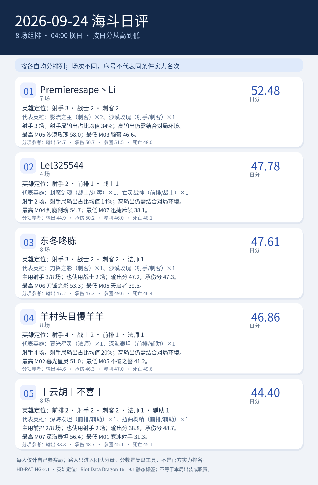

# 2026-09-24 海斗日评｜HD-RATING-2.1

<!-- HD-RATING-2.1 SUMMARY START -->

## 一图流：按分数排序

**序号说明**：按各自有效单局均分从高到低排序；参赛场次不同，序号仅代表已收集样本的均分大小，不代表同条件实力排名。

| 序号 | 队员 | 日分 | 场数 | 主要英雄定位 |
| ---: | --- | ---: | ---: | --- |
| 1 | Premieresape丶Li#45121 | 52.48 | 7 | 射手3／战士2／刺客2 |
| 2 | Let325544#73173 | 47.78 | 4 | 射手2／前排1／战士1 |
| 3 | 东冬咚胨#49567 | 47.61 | 8 | 射手3／战士2／刺客2／法师1 |
| 4 | 羊村头目慢羊羊#24440 | 46.86 | 8 | 射手4／战士2／前排1／法师1 |
| 5 | 丨云胡丨不喜丨#24728 | 44.40 | 8 | 前排2／射手2／刺客2／法师1／辅助1 |

### 逐人点评

**1. Premieresape丶Li#45121（7 场）**：代表英雄为影流之主（刺客）×2、沙漠玫瑰（射手/刺客）×1。射手 3 场，射手局输出占比均值 34%；高输出仍需结合对局环境。最高 M05 沙漠玫瑰 58.0；最低 M03 腕豪 46.6。

**2. Let325544#73173（4 场）**：代表英雄为封魔剑魂（战士/刺客）×1、亡灵战神（前排/战士）×1。射手 2 场，射手局输出占比均值 14%；高输出仍需结合对局环境。最高 M04 封魔剑魂 54.7；最低 M07 迅捷斥候 38.1。

**3. 东冬咚胨#49567（8 场）**：代表英雄为刀锋之影（刺客）×1、沙漠玫瑰（射手/刺客）×1。主用射手 3/8 场；也使用战士 2 场；输出分 47.2，承伤分 47.3。最高 M06 刀锋之影 53.3；最低 M05 天启者 39.5。

**4. 羊村头目慢羊羊#24440（8 场）**：代表英雄为暮光星灵（法师）×1、深海泰坦（前排/辅助）×1。射手 4 场，射手局输出占比均值 20%；高输出仍需结合对局环境。最高 M02 暮光星灵 51.0；最低 M05 不破之誓 41.2。

**5. 丨云胡丨不喜丨#24728（8 场）**：代表英雄为深海泰坦（前排/辅助）×1、扭曲树精（前排/辅助）×1。主用前排 2/8 场；也使用射手 2 场；输出分 38.8，承伤分 48.7。最高 M07 深海泰坦 56.4；最低 M01 寒冰射手 31.3。

英雄定位以 [Riot Data Dragon 16.19.1 静态标签](../../../references/riot_ddragon_16.19.1_英雄定位.json)为准；标签不说明本局出装、单前排状态或实际贡献。

<!-- HD-RATING-2.1 SUMMARY END -->

**版本**：[国服 26.19 更新公告](https://lol.qq.com/gicp/news/410/37097271.html)于 9 月 23 日维护上线，按截图所给日期推断本批比赛处于该版本；ARAMKit 页面标记 v16.19。**游戏日**：北京时间当天 04:00 至次日 04:00，按截图所在游戏日目录归属。
**范围**：六人名单中参加本场 3～5 人组排者记个人单局分；名单外玩家参与五人团队占比分母，不进入榜单。
**本场环境调整**：先将己方五名玩家（含名单外队友）各自的分均输出、分均真实承伤除以对应英雄参考速率，分别取五个倍率的中位数，并各与 1 取大值作为环境系数。个人原倍率除以对应系数后参与发挥分计算；本场占比仍使用截图显示值。系数与调整前后倍率见逐场 CSV。
**参考**：ARAMKit 全分段 173 名英雄的同版本页面冻结于 2026-09-28T06:33:57.431801+00:00；站点未统一展示总样本量。第三方“自我减免”和桌面端“自我减伤”作同义映射，**跨站承伤口径待核实**。
**样本**：8 场，名单队员 35 条单局记录；个人记录完整评分率 100%。04:00 开局归属以所给截图目录为准，未显示钟点的截图不补造精确时间。

**比较范围**：参评者的比赛集合不同，下列序号只表示个人日分大小，不代表同条件实力名次；请连同参赛场数阅读。

| 日分序位 | 队员 | 日分 | 场数 | 输出分 | 承伤分 | 参团分 | 死亡分 | 占比：输出 / 真实承伤 |
| ---: | --- | ---: | ---: | ---: | ---: | ---: | ---: | ---: |
| 1 | Premieresape丶Li#45121 | 52.5 | 7 | 54.7 | 50.7 | 51.5 | 48.0 | 28.9% / 19.9% |
| 2 | Let325544#73173 | 47.8 | 4 | 44.9 | 50.2 | 46.0 | 48.1 | 18.0% / 24.2% |
| 3 | 东冬咚胨#49567 | 47.6 | 8 | 47.2 | 47.3 | 49.6 | 46.4 | 21.0% / 17.9% |
| 4 | 羊村头目慢羊羊#24440 | 46.9 | 8 | 44.6 | 46.3 | 47.0 | 49.6 | 18.2% / 19.0% |
| 5 | 丨云胡丨不喜丨#24728 | 44.4 | 8 | 38.8 | 48.7 | 45.1 | 45.1 | 12.5% / 19.6% |

**阅读方式**：输出／承伤的调整后倍率或参团倍率等于 1 时，发挥分为 50，不是及格线；本场占比 20% 是数学参照，不是输出或承伤的英雄门槛。日分是每位队员当天参与的所有合格单局的等权平均；参赛场次不一致时分数序位不代表同条件实力名次。九方案名次范围只在同场比较时展示，不是统计置信区间。

**核对方法**：打开 [逐场评分明细](逐场评分明细_v2.1.csv) 查看英雄、五人中位数环境系数、调整前后倍率、原始显示值、占比、时长、击杀和九组参数分数。单局 `S＝0.70×(wO×O＋wT×T)＋0.20×参团分＋0.10×死亡分`。英雄参考见 [冻结快照](../../../references/aramkit_v16.19_全分段_2026-09-28.json)，定义见[评分标准](../../../docs/海斗日评与月评评分标准.md)。

## 逐场截图

| 场次 | 己方名单人数 | 时长 | 参评人数 | 截图 |
| --- | ---: | ---: | ---: | --- |
| M01 | 4 | 15:34 | 4 | [查看](../../../screenshots/2026-09-24/M01_DF41BC514EBE0E05E75FFFF0DC8A928B.png) |
| M02 | 3 | 18:39 | 3 | [查看](../../../screenshots/2026-09-24/M02_DF1BCB05B634E25D342B73A2456A27DB.png) |
| M03 | 5 | 16:43 | 5 | [查看](../../../screenshots/2026-09-24/M03_270EACFF5ED3D5AB494D374E17A805F4.png) |
| M04 | 5 | 21:01 | 5 | [查看](../../../screenshots/2026-09-24/M04_0A8BFC94C56A604B5AAACB14A1C1555F.png) |
| M05 | 4 | 12:58 | 4 | [查看](../../../screenshots/2026-09-24/M05_AF03F86F80A215AF80D8507CFC0746D1.png) |
| M06 | 4 | 21:25 | 4 | [查看](../../../screenshots/2026-09-24/M06_D11349D219C9DF6BF959E2A3D3AC6965.png) |
| M07 | 5 | 16:43 | 5 | [查看](../../../screenshots/2026-09-24/M07_8B554355E472C51850E2F283940F8E5A.png) |
| M08 | 5 | 20:49 | 5 | [查看](../../../screenshots/2026-09-24/M08_A02CACD51C1A5CEA47D1EADEC01E8AC8.png) |

分均输出和分均真实承伤均以截图保留的“万／k”精度计算；占比使用截图显示的整数百分比，所以五人的占比之和可能为 99%—101%。未根据这些取整值倒推精确总量。

英雄参考是 2026-09-28 取得的同版本公开聚合页面，并非比赛当时冻结的网页快照；网站没有提供逐场分布与所有字段的完整口径。日分只适合作为这套公开公式下的复盘参考。
