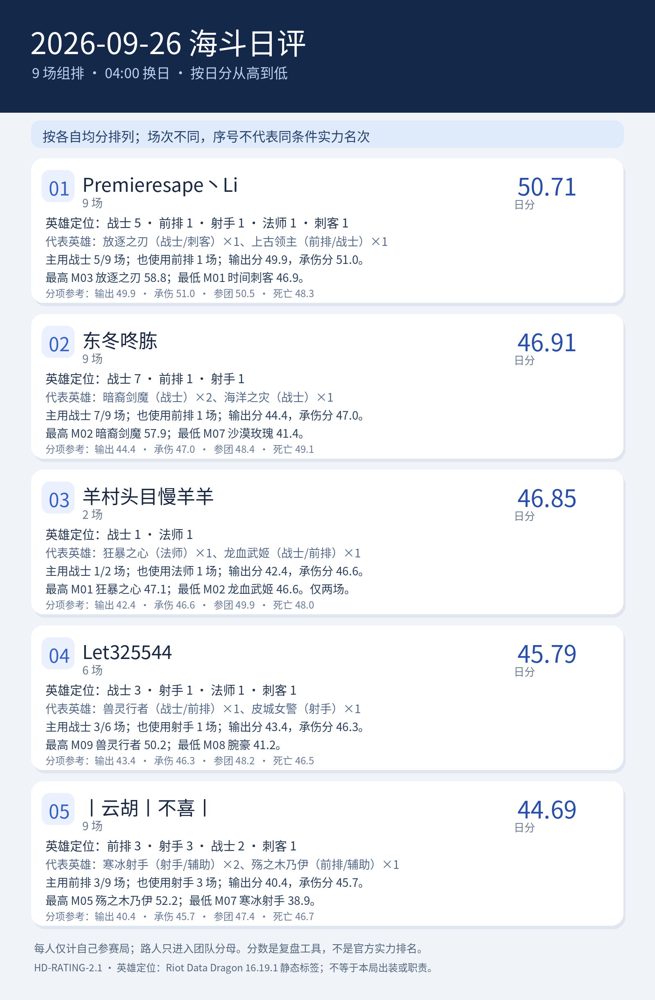

# 2026-09-26 海斗日评｜HD-RATING-2.1

<!-- HD-RATING-2.1 SUMMARY START -->

## 一图流：按分数排序

**序号说明**：按各自有效单局均分从高到低排序；参赛场次不同，序号仅代表已收集样本的均分大小，不代表同条件实力排名。

| 序号 | 队员 | 日分 | 场数 | 主要英雄定位 |
| ---: | --- | ---: | ---: | --- |
| 1 | Premieresape丶Li#45121 | 50.71 | 9 | 战士5／前排1／射手1／法师1／刺客1 |
| 2 | 东冬咚胨#49567 | 46.91 | 9 | 战士7／前排1／射手1 |
| 3 | 羊村头目慢羊羊#24440 | 46.85 | 2 | 战士1／法师1 |
| 4 | Let325544#73173 | 45.79 | 6 | 战士3／射手1／法师1／刺客1 |
| 5 | 丨云胡丨不喜丨#24728 | 44.69 | 9 | 前排3／射手3／战士2／刺客1 |

### 逐人点评

**1. Premieresape丶Li#45121（9 场）**：代表英雄为放逐之刃（战士/刺客）×1、上古领主（前排/战士）×1。主用战士 5/9 场；也使用前排 1 场；输出分 49.9，承伤分 51.0。最高 M03 放逐之刃 58.8；最低 M01 时间刺客 46.9。

**2. 东冬咚胨#49567（9 场）**：代表英雄为暗裔剑魔（战士）×2、海洋之灾（战士）×1。主用战士 7/9 场；也使用前排 1 场；输出分 44.4，承伤分 47.0。最高 M02 暗裔剑魔 57.9；最低 M07 沙漠玫瑰 41.4。

**3. 羊村头目慢羊羊#24440（2 场）**：代表英雄为狂暴之心（法师）×1、龙血武姬（战士/前排）×1。主用战士 1/2 场；也使用法师 1 场；输出分 42.4，承伤分 46.6。最高 M01 狂暴之心 47.1；最低 M02 龙血武姬 46.6。仅两场。

**4. Let325544#73173（6 场）**：代表英雄为兽灵行者（战士/前排）×1、皮城女警（射手）×1。主用战士 3/6 场；也使用射手 1 场；输出分 43.4，承伤分 46.3。最高 M09 兽灵行者 50.2；最低 M08 腕豪 41.2。

**5. 丨云胡丨不喜丨#24728（9 场）**：代表英雄为寒冰射手（射手/辅助）×2、殇之木乃伊（前排/辅助）×1。主用前排 3/9 场；也使用射手 3 场；输出分 40.4，承伤分 45.7。最高 M05 殇之木乃伊 52.2；最低 M07 寒冰射手 38.9。

英雄定位以 [Riot Data Dragon 16.19.1 静态标签](../../../references/riot_ddragon_16.19.1_英雄定位.json)为准；标签不说明本局出装、单前排状态或实际贡献。

<!-- HD-RATING-2.1 SUMMARY END -->

**版本**：[国服 26.19 更新公告](https://lol.qq.com/gicp/news/410/37097271.html)于 9 月 23 日维护上线，按截图所给日期推断本批比赛处于该版本；ARAMKit 页面标记 v16.19。**游戏日**：北京时间当天 04:00 至次日 04:00，按截图所在游戏日目录归属。
**范围**：六人名单中参加本场 3～5 人组排者记个人单局分；名单外玩家参与五人团队占比分母，不进入榜单。
**本场环境调整**：先将己方五名玩家（含名单外队友）各自的分均输出、分均真实承伤除以对应英雄参考速率，分别取五个倍率的中位数，并各与 1 取大值作为环境系数。个人原倍率除以对应系数后参与发挥分计算；本场占比仍使用截图显示值。系数与调整前后倍率见逐场 CSV。
**参考**：ARAMKit 全分段 173 名英雄的同版本页面冻结于 2026-09-28T06:33:57.431801+00:00；站点未统一展示总样本量。第三方“自我减免”和桌面端“自我减伤”作同义映射，**跨站承伤口径待核实**。
**样本**：9 场，名单队员 35 条单局记录；个人记录完整评分率 100%。04:00 开局归属以所给截图目录为准，未显示钟点的截图不补造精确时间。

**比较范围**：参评者的比赛集合不同，下列序号只表示个人日分大小，不代表同条件实力名次；请连同参赛场数阅读。

| 日分序位 | 队员 | 日分 | 场数 | 输出分 | 承伤分 | 参团分 | 死亡分 | 占比：输出 / 真实承伤 |
| ---: | --- | ---: | ---: | ---: | ---: | ---: | ---: | ---: |
| 1 | Premieresape丶Li#45121 | 50.7 | 9 | 49.9 | 51.0 | 50.5 | 48.3 | 24.0% / 25.4% |
| 2 | 东冬咚胨#49567 | 46.9 | 9 | 44.4 | 47.0 | 48.4 | 49.1 | 21.0% / 22.1% |
| 3 | 羊村头目慢羊羊#24440 | 46.8 | 2 | 42.4 | 46.6 | 49.9 | 48.0 | 18.0% / 21.0% |
| 4 | Let325544#73173 | 45.8 | 6 | 43.4 | 46.3 | 48.2 | 46.5 | 19.8% / 17.5% |
| 5 | 丨云胡丨不喜丨#24728 | 44.7 | 9 | 40.4 | 45.7 | 47.4 | 46.7 | 14.6% / 18.4% |

**阅读方式**：输出／承伤的调整后倍率或参团倍率等于 1 时，发挥分为 50，不是及格线；本场占比 20% 是数学参照，不是输出或承伤的英雄门槛。日分是每位队员当天参与的所有合格单局的等权平均；参赛场次不一致时分数序位不代表同条件实力名次。九方案名次范围只在同场比较时展示，不是统计置信区间。

**核对方法**：打开 [逐场评分明细](逐场评分明细_v2.1.csv) 查看英雄、五人中位数环境系数、调整前后倍率、原始显示值、占比、时长、击杀和九组参数分数。单局 `S＝0.70×(wO×O＋wT×T)＋0.20×参团分＋0.10×死亡分`。英雄参考见 [冻结快照](../../../references/aramkit_v16.19_全分段_2026-09-28.json)，定义见[评分标准](../../../docs/海斗日评与月评评分标准.md)。

## 逐场截图

| 场次 | 己方名单人数 | 时长 | 参评人数 | 截图 |
| --- | ---: | ---: | ---: | --- |
| M01 | 4 | 12:54 | 4 | [查看](../../../screenshots/2026-09-26/M01_51CF33ABD374D7A3D87DC6302E227218.png) |
| M02 | 4 | 17:36 | 4 | [查看](../../../screenshots/2026-09-26/M02_73369B3939370E4FAAA8DFCDD34E1F37.png) |
| M03 | 3 | 18:02 | 3 | [查看](../../../screenshots/2026-09-26/M03_E0A75D854539759DABE55A7B72F00DAF.png) |
| M04 | 4 | 19:04 | 4 | [查看](../../../screenshots/2026-09-26/M04_40A0B2484F7E046740DF2BC3D878A4CD.png) |
| M05 | 4 | 20:38 | 4 | [查看](../../../screenshots/2026-09-26/M05_B8101298736470003406BD85CA457CDF.png) |
| M06 | 4 | 17:37 | 4 | [查看](../../../screenshots/2026-09-26/M06_E7C5133B6D6D05F178DBB76E14D5FE5A.png) |
| M07 | 4 | 18:50 | 4 | [查看](../../../screenshots/2026-09-26/M07_37EB5AFB3AFC29446824A41E42FCD65B.png) |
| M08 | 4 | 19:27 | 4 | [查看](../../../screenshots/2026-09-26/M08_DB298D7816849E90E468D1AFC683349F.png) |
| M09 | 4 | 14:33 | 4 | [查看](../../../screenshots/2026-09-26/M09_C3BFFDE546E9107F3F27BFEA769D2E2A.png) |

分均输出和分均真实承伤均以截图保留的“万／k”精度计算；占比使用截图显示的整数百分比，所以五人的占比之和可能为 99%—101%。未根据这些取整值倒推精确总量。

英雄参考是 2026-09-28 取得的同版本公开聚合页面，并非比赛当时冻结的网页快照；网站没有提供逐场分布与所有字段的完整口径。日分只适合作为这套公开公式下的复盘参考。
