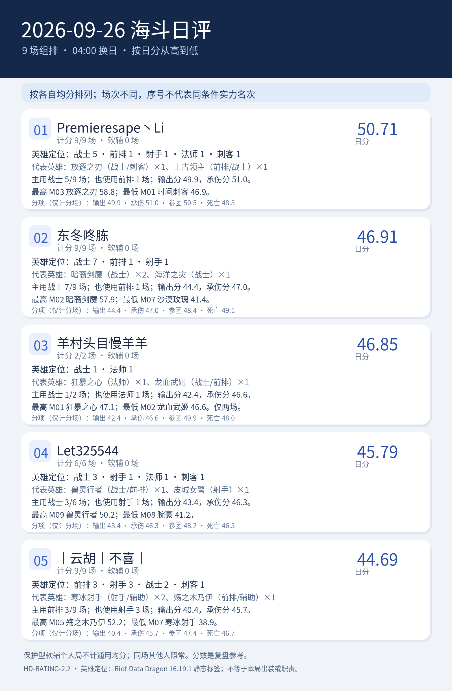

# 2026-09-26 海斗日评｜HD-RATING-2.2

<!-- HD-RATING-2.2 SUMMARY START -->

## 一图流：按分数排序

**序号说明**：按各自有效单局均分从高到低排序；参赛场次不同，序号仅代表已收集样本的均分大小，不代表同条件实力排名。

**软辅处理**：经逐局核验的保护型软辅选手保留战绩，不计该局通用综合分；仍参与同场队友五人团队分母和环境调整。下面英雄分布按实际参赛局，分项点评按纳入评分局。

| 序号 | 队员 | 日分 | 计分 / 实际 | 软辅 | 主要英雄定位 |
| ---: | --- | ---: | ---: | ---: | --- |
| 1 | Premieresape丶Li#45121 | 50.71 | 9 / 9 | 0 | 战士5／前排1／射手1／法师1／刺客1 |
| 2 | 东冬咚胨#49567 | 46.91 | 9 / 9 | 0 | 战士7／前排1／射手1 |
| 3 | 羊村头目慢羊羊#24440 | 46.85 | 2 / 2 | 0 | 战士1／法师1 |
| 4 | Let325544#73173 | 45.79 | 6 / 6 | 0 | 战士3／射手1／法师1／刺客1 |
| 5 | 丨云胡丨不喜丨#24728 | 44.69 | 9 / 9 | 0 | 前排3／射手3／战士2／刺客1 |

### 逐人点评

**1. Premieresape丶Li#45121（计分 9/9 场，软辅 0 场）**：代表英雄为放逐之刃（战士/刺客）×1、上古领主（前排/战士）×1。主用战士 5/9 场；也使用前排 1 场；输出分 49.9，承伤分 51.0。最高 M03 放逐之刃 58.8；最低 M01 时间刺客 46.9。

**2. 东冬咚胨#49567（计分 9/9 场，软辅 0 场）**：代表英雄为暗裔剑魔（战士）×2、海洋之灾（战士）×1。主用战士 7/9 场；也使用前排 1 场；输出分 44.4，承伤分 47.0。最高 M02 暗裔剑魔 57.9；最低 M07 沙漠玫瑰 41.4。

**3. 羊村头目慢羊羊#24440（计分 2/2 场，软辅 0 场）**：代表英雄为狂暴之心（法师）×1、龙血武姬（战士/前排）×1。主用战士 1/2 场；也使用法师 1 场；输出分 42.4，承伤分 46.6。最高 M01 狂暴之心 47.1；最低 M02 龙血武姬 46.6。仅两场。

**4. Let325544#73173（计分 6/6 场，软辅 0 场）**：代表英雄为兽灵行者（战士/前排）×1、皮城女警（射手）×1。主用战士 3/6 场；也使用射手 1 场；输出分 43.4，承伤分 46.3。最高 M09 兽灵行者 50.2；最低 M08 腕豪 41.2。

**5. 丨云胡丨不喜丨#24728（计分 9/9 场，软辅 0 场）**：代表英雄为寒冰射手（射手/辅助）×2、殇之木乃伊（前排/辅助）×1。主用前排 3/9 场；也使用射手 3 场；输出分 40.4，承伤分 45.7。最高 M05 殇之木乃伊 52.2；最低 M07 寒冰射手 38.9。

英雄定位以 [Riot Data Dragon 16.19.1 静态标签](../../../references/riot_ddragon_16.19.1_英雄定位.json)为准；标签不说明本局出装、单前排状态或实际贡献。

<!-- HD-RATING-2.2 SUMMARY END -->

**范围**：固定名单至少三人参加的组排；本日全场对局照常保留。仅逐局确认的保护型软辅选手不计算通用综合分，其他队员同场照常计分。路人和软辅仍参与五人占比和环境系数。
**公式**：其余对局沿用 v2.1 的单局公式，输出、承伤、参团、死亡均未改权重。排除名单及证据见 [逐局清单](../../../repro/soft_support_exclusions_v2.2.json)，规则见[评分标准](../../../docs/海斗日评与月评评分标准.md)。
**样本**：9 场组排；名单队员 35 条实际参赛记录，其中 0 条软辅个人记录不进入通用均分；纳入评分的比赛集合不同，序号只表示各自样本的均分大小。
**游戏日**：北京时间 04:00 至次日 04:00；部分截图未显示精确钟点，沿用用户给出的截图日期归属。英雄参考及版本推断沿用 v2.1，仍须注意跨站真实承伤口径未经完全核实。

| 均分序位 | 队员 | 可评分对局均分 | 纳入 / 实际 | 软辅场数 | 输出分 | 承伤分 | 参团分 | 死亡分 |
| ---: | --- | ---: | ---: | ---: | ---: | ---: | ---: | ---: |
| 1 | Premieresape丶Li#45121 | 50.71 | 9 / 9 | 0 | 49.9 | 51.0 | 50.5 | 48.3 |
| 2 | 东冬咚胨#49567 | 46.91 | 9 / 9 | 0 | 44.4 | 47.0 | 48.4 | 49.1 |
| 3 | 羊村头目慢羊羊#24440 | 46.85 | 2 / 2 | 0 | 42.4 | 46.6 | 49.9 | 48.0 |
| 4 | Let325544#73173 | 45.79 | 6 / 6 | 0 | 43.4 | 46.3 | 48.2 | 46.5 |
| 5 | 丨云胡丨不喜丨#24728 | 44.69 | 9 / 9 | 0 | 40.4 | 45.7 | 47.4 | 46.7 |

**判定与复核**：排除记录在 [v2.2 逐场明细](逐场评分明细_v2.2.csv)中以 `是否纳入通用均分=否` 标记，`单局综合分` 留空；`原公式试算分_v2.1` 仅供比较旧规则偏差，不纳入日月总分。v2.1 和 v2.0 历史 CSV 均保留原文件。
**阅读方式**：纳入率表示本版可使用的通用评分覆盖率，并非数据采集完整率；软辅局数据完整，但职责未被通用公式衡量。纳入场数不同或所玩场次不同，均分序位不能解释为同条件实力名次。

## 逐场截图

| 场次 | 队内参评者 | 原始截图 |
| --- | ---: | --- |
| M01 | 4 | [查看](../../../screenshots/2026-09-26/M01_51CF33ABD374D7A3D87DC6302E227218.png) |
| M02 | 4 | [查看](../../../screenshots/2026-09-26/M02_73369B3939370E4FAAA8DFCDD34E1F37.png) |
| M03 | 3 | [查看](../../../screenshots/2026-09-26/M03_E0A75D854539759DABE55A7B72F00DAF.png) |
| M04 | 4 | [查看](../../../screenshots/2026-09-26/M04_40A0B2484F7E046740DF2BC3D878A4CD.png) |
| M05 | 4 | [查看](../../../screenshots/2026-09-26/M05_B8101298736470003406BD85CA457CDF.png) |
| M06 | 4 | [查看](../../../screenshots/2026-09-26/M06_E7C5133B6D6D05F178DBB76E14D5FE5A.png) |
| M07 | 4 | [查看](../../../screenshots/2026-09-26/M07_37EB5AFB3AFC29446824A41E42FCD65B.png) |
| M08 | 4 | [查看](../../../screenshots/2026-09-26/M08_DB298D7816849E90E468D1AFC683349F.png) |
| M09 | 4 | [查看](../../../screenshots/2026-09-26/M09_C3BFFDE546E9107F3F27BFEA769D2E2A.png) |
