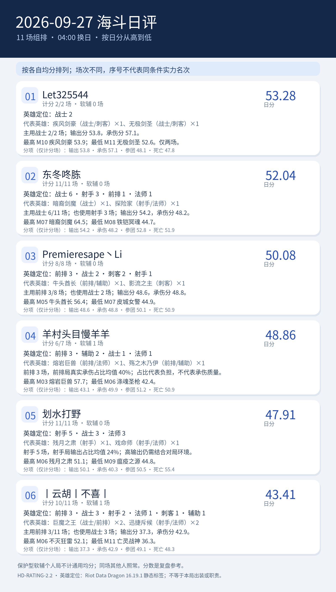

# 2026-09-27 海斗日评｜HD-RATING-2.2

<!-- HD-RATING-2.2 SUMMARY START -->

## 一图流：按分数排序

**序号说明**：按各自有效单局均分从高到低排序；参赛场次不同，序号仅代表已收集样本的均分大小，不代表同条件实力排名。

**软辅处理**：经逐局核验的保护型软辅选手保留战绩，不计该局通用综合分；仍参与同场队友五人团队分母和环境调整。下面英雄分布按实际参赛局，分项点评按纳入评分局。

| 序号 | 队员 | 日分 | 计分 / 实际 | 软辅 | 主要英雄定位 |
| ---: | --- | ---: | ---: | ---: | --- |
| 1 | Let325544#73173 | 53.28 | 2 / 2 | 0 | 战士2 |
| 2 | 东冬咚胨#49567 | 52.04 | 11 / 11 | 0 | 战士6／射手3／前排1／法师1 |
| 3 | Premieresape丶Li#45121 | 50.08 | 8 / 8 | 0 | 前排3／战士2／刺客2／射手1 |
| 4 | 羊村头目慢羊羊#24440 | 48.86 | 6 / 7 | 1 | 前排3／辅助2／战士1／法师1 |
| 5 | 划水打野#51907 | 47.91 | 11 / 11 | 0 | 射手5／战士3／法师3 |
| 6 | 丨云胡丨不喜丨#24728 | 43.41 | 10 / 11 | 1 | 前排3／战士3／射手2／法师1／刺客1／辅助1 |

### 逐人点评

**1. Let325544#73173（计分 2/2 场，软辅 0 场）**：代表英雄为疾风剑豪（战士/刺客）×1、无极剑圣（战士/刺客）×1。主用战士 2/2 场；输出分 53.8，承伤分 57.1。最高 M10 疾风剑豪 53.9；最低 M11 无极剑圣 52.6。仅两场。

**2. 东冬咚胨#49567（计分 11/11 场，软辅 0 场）**：代表英雄为暗裔剑魔（战士）×1、探险家（射手/法师）×1。主用战士 6/11 场；也使用射手 3 场；输出分 54.2，承伤分 48.2。最高 M07 暗裔剑魔 64.5；最低 M08 铁铠冥魂 44.7。

**3. Premieresape丶Li#45121（计分 8/8 场，软辅 0 场）**：代表英雄为牛头酋长（前排/辅助）×1、影流之主（刺客）×1。主用前排 3/8 场；也使用战士 2 场；输出分 48.6，承伤分 48.8。最高 M05 牛头酋长 56.4；最低 M07 皮城女警 44.9。

**4. 羊村头目慢羊羊#24440（计分 6/7 场，软辅 1 场）**：代表英雄为熔岩巨兽（前排/法师）×1、殇之木乃伊（前排/辅助）×1。前排 3 场，前排局真实承伤占比均值 40%；占比代表负担，不代表承伤质量。最高 M03 熔岩巨兽 57.7；最低 M06 涤魂圣枪 42.4。

**5. 划水打野#51907（计分 11/11 场，软辅 0 场）**：代表英雄为残月之肃（射手）×1、戏命师（射手/法师）×1。射手 5 场，射手局输出占比均值 24%；高输出仍需结合对局环境。最高 M06 残月之肃 51.1；最低 M09 瘟疫之源 44.8。

**6. 丨云胡丨不喜丨#24728（计分 10/11 场，软辅 1 场）**：代表英雄为巨魔之王（战士/前排）×2、迅捷斥候（射手/法师）×2。主用前排 3/11 场；也使用战士 3 场；输出分 37.3，承伤分 42.9。最高 M06 不灭狂雷 52.1；最低 M11 亡灵战神 36.3。

英雄定位以 [Riot Data Dragon 16.19.1 静态标签](../../../references/riot_ddragon_16.19.1_英雄定位.json)为准；标签不说明本局出装、单前排状态或实际贡献。

<!-- HD-RATING-2.2 SUMMARY END -->

**范围**：固定名单至少三人参加的组排；本日全场对局照常保留。仅逐局确认的保护型软辅选手不计算通用综合分，其他队员同场照常计分。路人和软辅仍参与五人占比和环境系数。
**公式**：其余对局沿用 v2.1 的单局公式，输出、承伤、参团、死亡均未改权重。排除名单及证据见 [逐局清单](../../../repro/soft_support_exclusions_v2.2.json)，规则见[评分标准](../../../docs/海斗日评与月评评分标准.md)。
**样本**：11 场组排；名单队员 50 条实际参赛记录，其中 2 条软辅个人记录不进入通用均分；纳入评分的比赛集合不同，序号只表示各自样本的均分大小。
**游戏日**：北京时间 04:00 至次日 04:00；部分截图未显示精确钟点，沿用用户给出的截图日期归属。英雄参考及版本推断沿用 v2.1，仍须注意跨站真实承伤口径未经完全核实。

| 均分序位 | 队员 | 可评分对局均分 | 纳入 / 实际 | 软辅场数 | 输出分 | 承伤分 | 参团分 | 死亡分 |
| ---: | --- | ---: | ---: | ---: | ---: | ---: | ---: | ---: |
| 1 | Let325544#73173 | 53.28 | 2 / 2 | 0 | 53.8 | 57.1 | 48.1 | 47.8 |
| 2 | 东冬咚胨#49567 | 52.04 | 11 / 11 | 0 | 54.2 | 48.2 | 52.8 | 51.9 |
| 3 | Premieresape丶Li#45121 | 50.08 | 8 / 8 | 0 | 48.6 | 48.8 | 50.1 | 50.9 |
| 4 | 羊村头目慢羊羊#24440 | 48.86 | 6 / 7 | 1 | 43.1 | 49.9 | 51.2 | 50.9 |
| 5 | 划水打野#51907 | 47.91 | 11 / 11 | 0 | 50.1 | 40.3 | 50.5 | 55.4 |
| 6 | 丨云胡丨不喜丨#24728 | 43.41 | 10 / 11 | 1 | 37.3 | 42.9 | 49.1 | 48.3 |

**判定与复核**：排除记录在 [v2.2 逐场明细](逐场评分明细_v2.2.csv)中以 `是否纳入通用均分=否` 标记，`单局综合分` 留空；`原公式试算分_v2.1` 仅供比较旧规则偏差，不纳入日月总分。v2.1 和 v2.0 历史 CSV 均保留原文件。
**阅读方式**：纳入率表示本版可使用的通用评分覆盖率，并非数据采集完整率；软辅局数据完整，但职责未被通用公式衡量。纳入场数不同或所玩场次不同，均分序位不能解释为同条件实力名次。

## 逐场截图

| 场次 | 队内参评者 | 原始截图 |
| --- | ---: | --- |
| M01 | 4 | [查看](../../../screenshots/2026-09-27/M01_926742ADDB85E1227EDD0424FECFBEE9.png) |
| M02 | 4 | [查看](../../../screenshots/2026-09-27/M02_232DA761B2AFEDDF3E54CC9388C0BCB1.png) |
| M03 | 4 | [查看](../../../screenshots/2026-09-27/M03_743334C6361D99B9A8D5BDF7C0109802.png) |
| M04 | 5 | [查看](../../../screenshots/2026-09-27/M04_B55C1D56D0E761FC882AB4DE54773BE8.png) |
| M05 | 5 | [查看](../../../screenshots/2026-09-27/M05_A4064B401D8987A6691D71BF7CFF24D5.png) |
| M06 | 5 | [查看](../../../screenshots/2026-09-27/M06_11756AC10D8093CB872F731710BA841D.png) |
| M07 | 5 | [查看](../../../screenshots/2026-09-27/M07_42E42D977C2BB8359D24DA8BCB01E33B.png) |
| M08 | 4 | [查看](../../../screenshots/2026-09-27/M08_75BBD059E1670203CB12CE552A1101A7.png) |
| M09 | 4 | [查看](../../../screenshots/2026-09-27/M09_0F15D07DC0774B789A83C239D55230D4.png) |
| M10 | 5 | [查看](../../../screenshots/2026-09-27/M10_D40857DCC36FBB5B8D7715B129A1AD08.png) |
| M11 | 5 | [查看](../../../screenshots/2026-09-27/M11_3147B5F5FAF347B59B2835E506608F27.png) |
