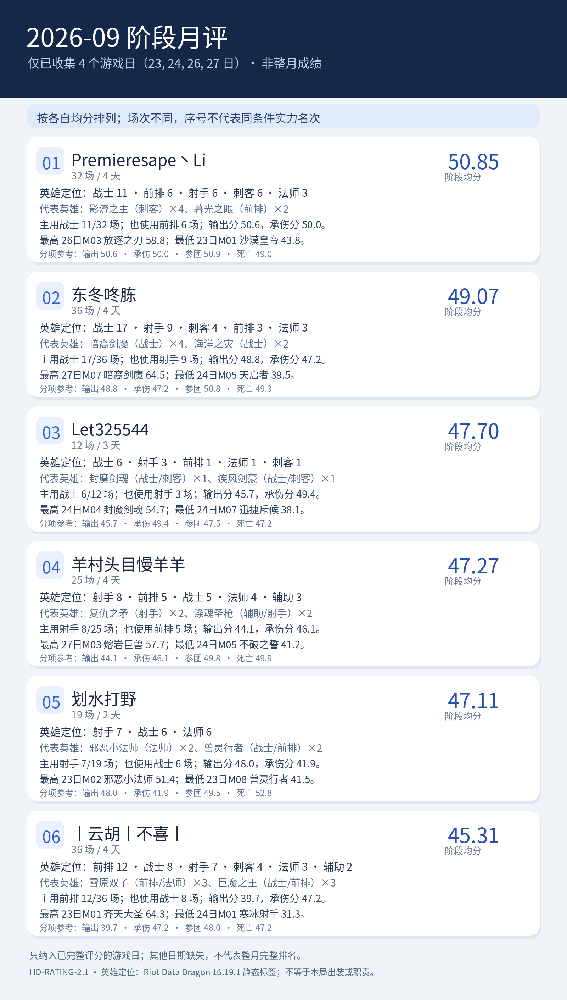

# 2026-09 阶段月评｜HD-RATING-2.1

<!-- HD-RATING-2.1 SUMMARY START -->

## 一图流：按分数排序

**序号说明**：按各自有效单局均分从高到低排序；参赛场次不同，序号仅代表已收集样本的均分大小，不代表同条件实力排名。

| 序号 | 队员 | 阶段均分 | 场数 | 主要英雄定位 |
| ---: | --- | ---: | ---: | --- |
| 1 | Premieresape丶Li#45121 | 50.85 | 32 | 战士11／前排6／射手6／刺客6／法师3 |
| 2 | 东冬咚胨#49567 | 49.07 | 36 | 战士17／射手9／刺客4／前排3／法师3 |
| 3 | Let325544#73173 | 47.70 | 12 | 战士6／射手3／前排1／法师1／刺客1 |
| 4 | 羊村头目慢羊羊#24440 | 47.27 | 25 | 射手8／前排5／战士5／法师4／辅助3 |
| 5 | 划水打野#51907 | 47.11 | 19 | 射手7／战士6／法师6 |
| 6 | 丨云胡丨不喜丨#24728 | 45.31 | 36 | 前排12／战士8／射手7／刺客4／法师3／辅助2 |

### 逐人点评

**1. Premieresape丶Li#45121（32 场）**：代表英雄为影流之主（刺客）×4、暮光之眼（前排）×2。主用战士 11/32 场；也使用前排 6 场；输出分 50.6，承伤分 50.0。最高 26日M03 放逐之刃 58.8；最低 23日M01 沙漠皇帝 43.8。

**2. 东冬咚胨#49567（36 场）**：代表英雄为暗裔剑魔（战士）×4、海洋之灾（战士）×2。主用战士 17/36 场；也使用射手 9 场；输出分 48.8，承伤分 47.2。最高 27日M07 暗裔剑魔 64.5；最低 24日M05 天启者 39.5。

**3. Let325544#73173（12 场）**：代表英雄为封魔剑魂（战士/刺客）×1、疾风剑豪（战士/刺客）×1。主用战士 6/12 场；也使用射手 3 场；输出分 45.7，承伤分 49.4。最高 24日M04 封魔剑魂 54.7；最低 24日M07 迅捷斥候 38.1。

**4. 羊村头目慢羊羊#24440（25 场）**：代表英雄为复仇之矛（射手）×2、涤魂圣枪（辅助/射手）×2。主用射手 8/25 场；也使用前排 5 场；输出分 44.1，承伤分 46.1。最高 27日M03 熔岩巨兽 57.7；最低 24日M05 不破之誓 41.2。

**5. 划水打野#51907（19 场）**：代表英雄为邪恶小法师（法师）×2、兽灵行者（战士/前排）×2。主用射手 7/19 场；也使用战士 6 场；输出分 48.0，承伤分 41.9。最高 23日M02 邪恶小法师 51.4；最低 23日M08 兽灵行者 41.5。

**6. 丨云胡丨不喜丨#24728（36 场）**：代表英雄为雪原双子（前排/法师）×3、巨魔之王（战士/前排）×3。主用前排 12/36 场；也使用战士 8 场；输出分 39.7，承伤分 47.2。最高 23日M01 齐天大圣 64.3；最低 24日M01 寒冰射手 31.3。

英雄定位以 [Riot Data Dragon 16.19.1 静态标签](../../references/riot_ddragon_16.19.1_英雄定位.json)为准；标签不说明本局出装、单前排状态或实际贡献。

<!-- HD-RATING-2.1 SUMMARY END -->
