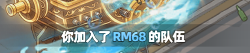
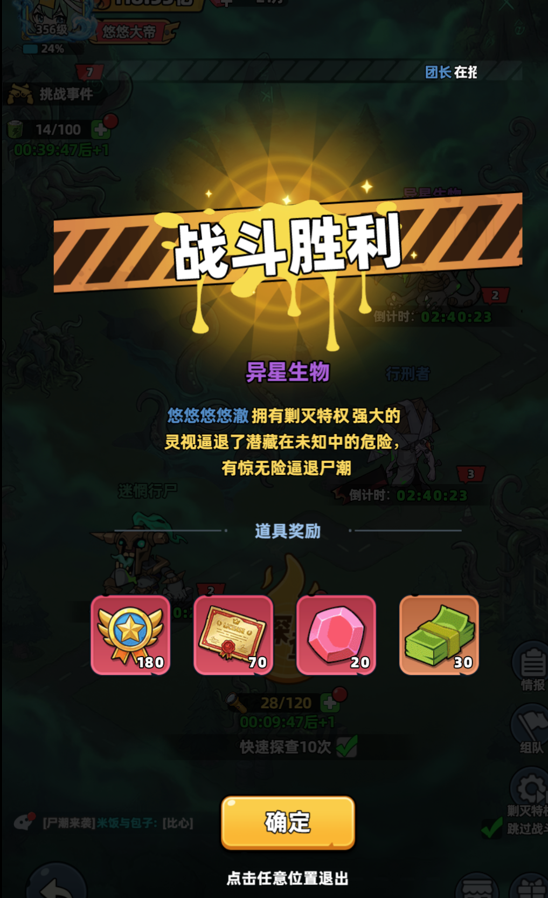
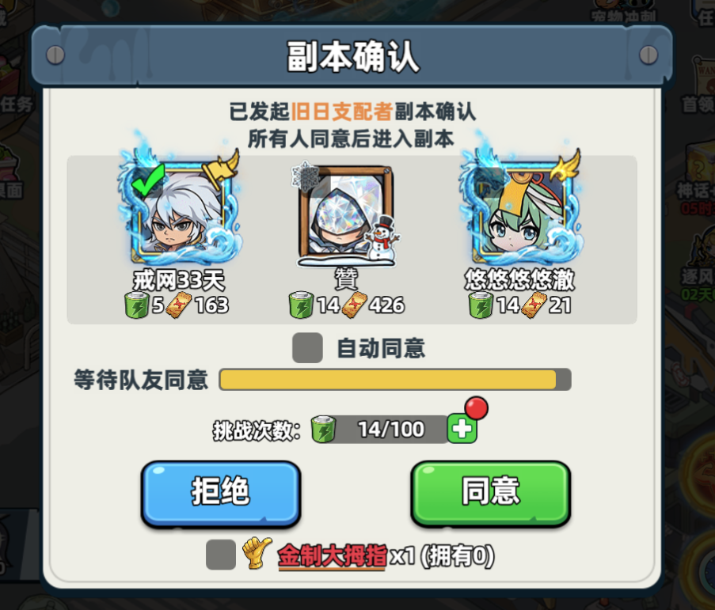
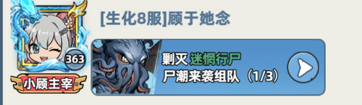
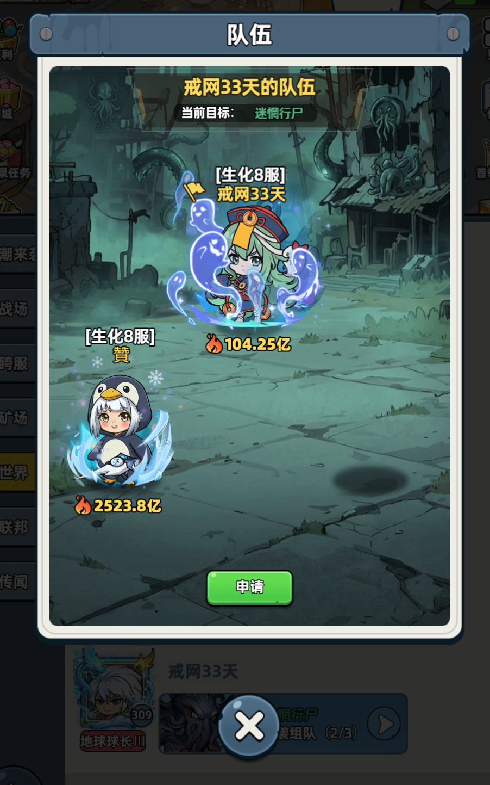
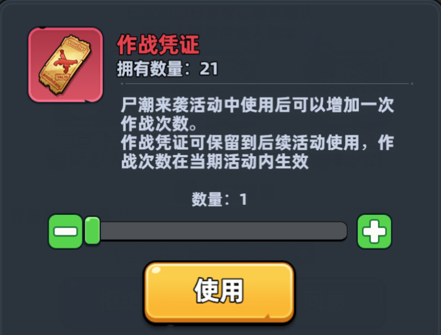

游戏规则：
1、玩家可以探测boss，探测完后可以分享到聊天频道邀请其他玩家一起加入，其他玩家可以点击邀请来申请加入组队，一起击杀boss
2、组队满后，等待发起者发起挑战，其余玩家可以通过发起目标来点击接受或者拒绝。

脚本需求：
1、 监控聊天频道，当出现（旧日支配者）或者（古神真容）时，点击申请加入组队，申请结束后，关闭队伍信息，继续监控聊天频道
2、当出现挑战信息时，根据调整目标，出现（旧日支配者）或者（古神真容）时，接受挑战，否则拒绝挑战并退出退伍。
3、我无法获取游戏内的接口信息，我只能通过扫描屏幕来获取信息

问题一: 目标设置如何换行，我输入回车就会自动保存设置
问题二：申请加入需要点击两次，第一次是点击查看队伍信息，然后才能点击申请
问题三：现在退出队伍比较麻烦，有两种方式
	一：是点击别人新发的邀请信息，点击后展示队伍信息，再点击退出队伍。缺点是聊天频道不总是有的。得等待
	二：点击空白区域取消聊天频道。然后点击活动，点击前往，再点击队伍，再点击退出队伍。缺点是步骤多
问题四：当别人发起挑战时，可能会出现体力不足，需要补充体力的按钮，需要点击一下同意

流程分为
	1、 监控聊天频道，当出现类似图片一的卡片时（需要检测该类型的卡片，因为聊天框可能会出现其他类型的聊天信息），判断boss类型。不符合要求则不处理并继续监控、符合要求则点击卡片中的箭头按钮，然后再点击新弹出弹框的申请按钮（图片二）。然后直接点击 X 图片退出队伍信息页面，继续监控聊天频道。
	2、 出现入队成功的信息后，不再监控频道，等待发起挑战，这里会出现两种弹框，一种是体力不足弹框，另一种是副本确认弹框。如果出现体力不足弹框，则点击确认。补充体力后自动进入副本确认弹框。检测到副本确认弹框后，再判断boss类型。如果符合条件，则同意，否则拒绝。拒绝后触发退出队伍流程。
	3、退出队伍流程结束后，进入聊天窗口的尸潮频道。继续步骤一

还存在一些问题
1、 校准设置现在只能按流程去补充位置了，没有办法补充单个位置。
2、 校准设置能否自动获取屏幕的分辨率，然后预设一个在屏幕中的占比，并且之后校准之后也是保存的相对位置，而不是绝对的坐标点。然后根据相对位置来计算
3、项目名称更改为：尸潮来袭助手。

